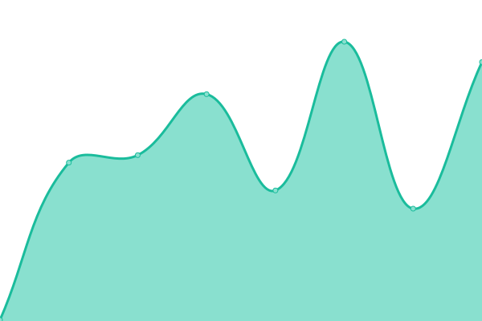

# [📈 Live Status](https://upptime.ikuda.net): <!--live status--> **🟩 All systems operational**

This repository contains the open-source uptime monitor and status page for [ikuda.net](https://ikuda.net), powered by [Upptime](https://github.com/upptime/upptime).

With [Upptime](https://upptime.js.org), you can get your own unlimited and free uptime monitor and status page, powered entirely by a GitHub repository. We use [Issues](https://github.com/ikudanet/upptime/issues) as incident reports, [Actions](https://github.com/ikudanet/upptime/actions) as uptime monitors, and [Pages](https://upptime.ikuda.net) for the status page.

<!--start: status pages-->
<!-- This summary is generated by Upptime (https://github.com/upptime/upptime) -->
<!-- Do not edit this manually, your changes will be overwritten -->
<!-- prettier-ignore -->
| URL | Status | History | Response Time | Uptime |
| --- | ------ | ------- | ------------- | ------ |
|  [ikuda.net](https://ikuda.net) | 🟩 Up | [ikuda-net.yml](https://github.com/ikudanet/upptime/commits/HEAD/history/ikuda-net.yml) | 

 192ms
     
 | 

<a href="https://upptime.ikuda.net/history/ikuda-net">100.00%</a>
    

|  [Cloudflare R2 @ a.ikuda.net](https://a.ikuda.net) | 🟩 Up | [cloudflare-r2-a-ikuda-net.yml](https://github.com/ikudanet/upptime/commits/HEAD/history/cloudflare-r2-a-ikuda-net.yml) | 

 99ms
     
 | 

<a href="https://upptime.ikuda.net/history/cloudflare-r2-a-ikuda-net">100.00%</a>
    

|  [ikuda.net archive](https://archive.ikuda.net) | 🟩 Up | [ikuda-net-archive.yml](https://github.com/ikudanet/upptime/commits/HEAD/history/ikuda-net-archive.yml) | 

 200ms
     
 | 

<a href="https://upptime.ikuda.net/history/ikuda-net-archive">100.00%</a>
    

|  [Upptime](https://upptime.ikuda.net) | 🟩 Up | [upptime.yml](https://github.com/ikudanet/upptime/commits/HEAD/history/upptime.yml) | 

 98ms
     
 | 

<a href="https://upptime.ikuda.net/history/upptime">100.00%</a>
    

<!--end: status pages-->

[**Visit our status website →**](https://upptime.ikuda.net)

## 📄 License

- Powered by: [Upptime](https://github.com/upptime/upptime)
- Code: [MIT](./LICENSE) © [Anand Chowdhary](https://anandchowdhary.com), supported by [Pabio](https://pabio.com)
- Data in the `./history` directory: [Open Database License](https://opendatacommons.org/licenses/odbl/1-0/)
